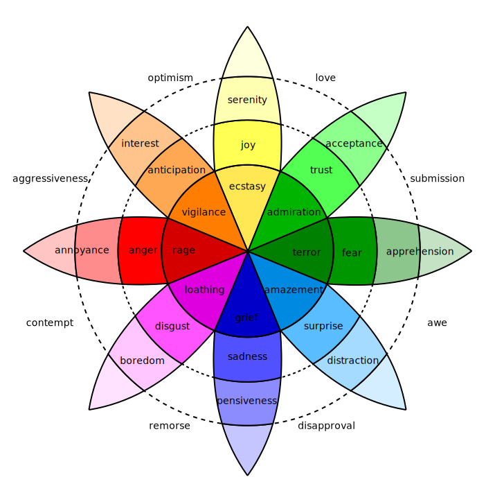

# Generative Sentiments - Web

Built with [Vue.js](https://vuejs.org/), [Vuex](https://vuex.vuejs.org/), and [Vue-P5](https://github.com/Kinrany/vue-p5), this web app allows you to view/interact/create artwork that matches your emotional state.

## Project setup

```
yarn install
```

### Compiles and hot-reloads for development

```
yarn serve
```

### Compiles and minifies for production

```
yarn build
```

### Lints and fixes files

```
yarn lint
```

## Related projects

- The [backend of this web app](https://github.com/tdarnett/generative-sentiments-backend) which is broken down into two main sections:
  1. The [Bi-directional LSTM NLP Model](https://github.com/tdarnett/generative-sentiments-backend/model/README.md) used to predict the emotion from input text
  2. The [Generative Sentiments API](https://github.com/tdarnett/generative-sentiments-backend/api/README.md) consumed in this repo

## Notes

Currently only six emotions are predicted, and the colours matching these emotions are based off [Robert Pulchik's psychological research](https://en.wikipedia.org/wiki/Robert_Plutchik#Plutchik's_wheel_of_emotions).



Much of the generated artwork is inspired and adapted by p5 examples [here](https://p5js.org/examples/), and [here](http://www.generative-gestaltung.de/2/).
